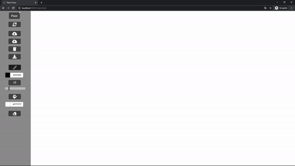

### Paint Clone

Very straightforward implementation of the Paint. Done using VanillaJS and HTML Canvas API.

### Functionalities

- Clear current image,
- Save to localStorage,
- Load from localStorage,
- Clear localStorage,
- Download as an image(jpeg),
- Select the paint,
- Change color of the paint,
- Change paint size,
- Change color of the background,
- Select the eraser.

### How it looks:

### Check it live:

[Paint Clone](https://userq11.github.io/paint-clone-js/).
